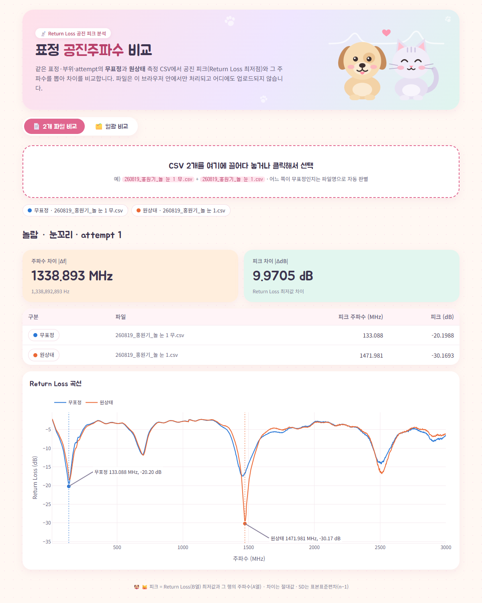
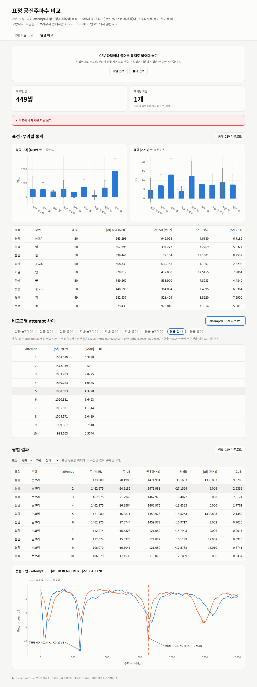

<div align="center">

# 📡 표정 공진주파수 비교

**무표정 vs 원상태** 센서 측정 CSV에서 공진 피크와 주파수를 뽑아 차이를 한눈에 비교하는 웹 도구

[](https://first-won-lab.github.io/analysis-project/)


### 👉 [웹에서 바로 쓰기](https://first-won-lab.github.io/analysis-project/)

</div>

---

## ✨ 무엇을 하나요?

얼굴의 **놀람 · 화남 · 웃음** 표정에서 **눈꼬리 · 입 · 볼** 부위를 센서로 측정한 Return Loss 스윕(CSV)을,
같은 표정 · 부위 · attempt의 **무표정** 측정값과 짝지어 비교합니다.

| | |
|---|---|
| 🎯 **피크 추출** | Return Loss(B열) **최저값**과 그 행의 **주파수**(A열) |
| 📏 **비교값** | `\|Δf\| = \|f원 − f무\|`, `\|ΔdB\| = \|dB원 − dB무\|` (절대값) |
| 🔒 **개인정보** | 파일은 브라우저 안에서만 처리되고 어디에도 업로드되지 않음 |
| 🚫 **잘못된 짝 차단** | 표정 · 부위 · attempt가 다르거나 둘 다 무표정(또는 둘 다 원상태)이면 비교하지 않고 원인 파일명을 알려 줌 |

## 🖼️ 화면

<table>
<tr>
<td width="50%"><b>2개 파일 비교</b><br></td>
<td width="50%"><b>일괄 비교</b><br></td>
</tr>
</table>

## 🚀 사용법

### 1) 2개 파일 비교
1. **2개 파일 비교** 탭에서 CSV 2개를 끌어다 놓거나 클릭해서 고릅니다.
2. 어느 쪽이 무표정인지는 파일명의 `무`로 자동 판별합니다.
3. `|Δf|`, `|ΔdB|` 카드와 두 Return Loss 곡선(피크 표시)이 나옵니다.

### 2) 일괄 비교
1. **일괄 비교** 탭에서 CSV 여러 개 또는 **폴더 통째로** 올립니다.
2. 파일명으로 쌍을 자동으로 맞추고, 같은 이름의 파일은 한 번만 계산합니다.
3. 표정 · 부위별 평균 ± 표준편차 그래프와 표, 쌍별 결과 표가 나옵니다.
   - **비교군별 attempt 차이**: 비교군(예: 웃음·입) 버튼을 고르면 그 비교군의 attempt별 `|Δf|` · `|ΔdB|`를 표로 나열하고, 아래에 평균 · SD를 붙입니다. 짝이 없는 attempt는 사유와 함께 표시합니다.
   - 표 머리글을 누르면 정렬, 행을 누르면 그 쌍의 곡선을 겹쳐 보여 줍니다.
   - 결과는 **CSV로 다운로드**할 수 있습니다 (엑셀에서 한글이 깨지지 않게 UTF-8 BOM).

### 3) 로컬 Python 스크립트
```bash
python python/auto_ver4.py                       # 폴더 선택 창
python python/auto_ver4.py "<데이터 폴더>" -o 결과폴더
```
표준 라이브러리만 씁니다. 콘솔에 쌍별 결과 · 통계 · 제외 파일을 출력하고, `auto_ver4_results/`에 CSV를 저장합니다.

| 저장 파일 | 내용 |
|---|---|
| `비교결과_쌍별_*.csv` | 쌍마다 무표정 · 원상태 피크와 `\|Δf\|`, `\|ΔdB\|` |
| `비교결과_통계_*.csv` | 표정 · 부위별 평균 · 표준편차 |
| `비교결과_attempt별_*.csv` | 행 = 비교군 × 항목(`\|Δf\|(Hz)`, `\|ΔdB\|`), 열 = attempt. 짝 없는 칸은 `짝 없음` (웹에서도 같은 파일을 내려받을 수 있음) |
| `비교결과_제외파일_*.csv` | 비교에서 빠진 파일과 사유 (있을 때만) |

## 📁 파일명 규칙

```
<날짜>_<이름>_<표정> <부위> <attempt>[ 무].csv
260819_홍원기_놀 눈 1 무.csv   ← 무표정
260819_홍원기_놀 눈 1.csv      ← 원상태  (위 파일과 비교 대상)
```

| 표정 | 부위 | 무표정 표시 |
|---|---|---|
| `놀` 놀람 · `화` 화남 · `웃` 웃음 | `눈` 눈꼬리 · `입` 입 · `볼` 볼 | 끝에 ` 무` |

CSV는 A열 주파수(Hz), B열 Return Loss(dB)를 읽고, 헤더처럼 숫자가 아닌 행은 건너뜁니다.

## 🗂️ 구조

```
├── index.html              # 웹앱 (GitHub Pages 진입점)
├── assets/
│   ├── analysis.js         # 계산 로직 (DOM 없음) ─┐ 결과가 같아야 함
│   ├── app.js              # 화면 동작             │
│   └── style.css           #                       │
├── python/auto_ver4.py     # 로컬 일괄 분석 ───────┘
├── tests/
│   ├── cases.json          # JS · Python 공통 테스트 케이스
│   ├── test_auto_ver4.py   # python -m unittest discover tests
│   └── analysis.test.html  # 브라우저에서 여는 JS 테스트
├── docs/MAINTENANCE.md     # 유지보수 지침
└── CLAUDE.md               # AI 작업 지침
```

## 🛠️ 개발 · 유지보수

빌드 과정이 없습니다. 로컬 서버로 열어서 확인합니다.

```bash
python -m http.server 8000
# http://localhost:8000/                       → 웹앱
# http://localhost:8000/tests/analysis.test.html → JS 테스트
python -m unittest discover tests              # Python 테스트
```

수정 절차, 검증 체크리스트, 배포 방법은 **[docs/MAINTENANCE.md](docs/MAINTENANCE.md)** 에 있습니다.

## 🌐 배포

`main` 브랜치 루트를 GitHub Pages로 서비스합니다.
**Settings → Pages → Build and deployment → Source: _Deploy from a branch_, Branch: `main` / `(root)`**

---

<div align="center"><sub>First-Won-Lab · 측정 원본 데이터는 이 저장소에 포함하지 않습니다.</sub></div>
